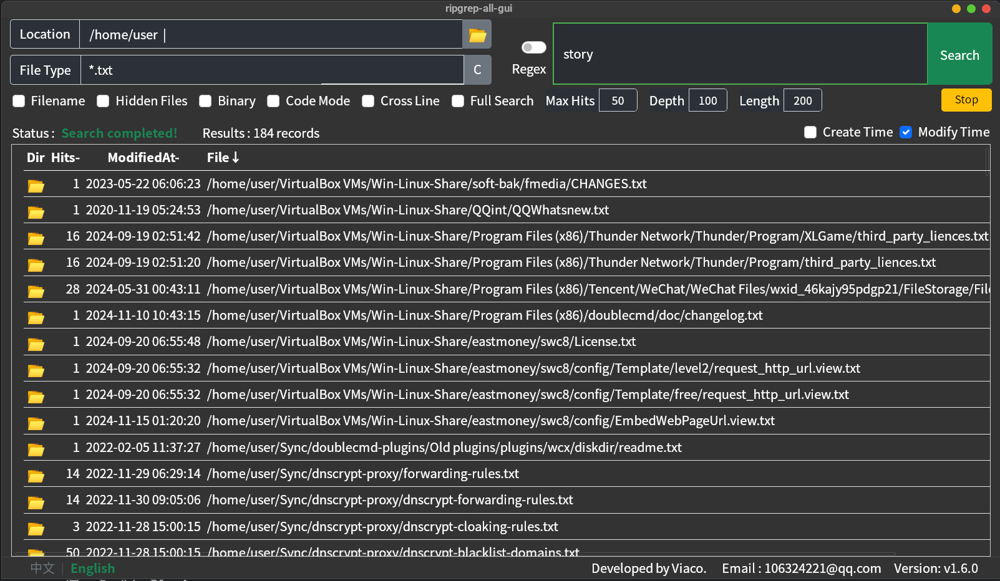

# ripgrep-all-gui

>Developer: Viaco  
>Email: viaco.xu@qq.com

You don’t need to know the file location or file name. As long as you remember a word or a few words contained in the file, this software can help you find it.

This is a high-performance full-text search tool designed to quickly search through huge amounts of data on your hard drive. It searches file contents, and can also search file names.

It can search text inside ZIP archives without extracting them first.

Supported file types include various archive formats, Office documents, e-books, SQLite databases, PDFs, movie subtitles, and virtually any other text-based files. It can even search for text embedded inside EXE programs.


## Features 

1. **No Indexing**

Most mainstream full-text search applications rely on indexing. Their indexes can take up several gigabytes of disk space and continue growing over time.

This software requires no index at all.

2. **Fast**

The software is written in Rust, with performance close to that of C.

Although it cannot match the speed of an indexed search, it is designed to be extremely fast for a non-indexed full-text search tool.

In addition to its high-performance implementation, it utilizes all available CPU resources and performs searches using multiple threads in parallel, allowing the CPU to run at full load when necessary.

3. **Advanced Search**

For ordinary users, you can simply enter a single keyword or combine multiple keywords.

For advanced users, regular expressions are supported. Combined with file-type wildcards, this allows you to implement virtually any complex search logic.

The interface is simple, but the functionality is anything but simple!

4. **Comprehensive Results**

Compared with a mainstream full-text search application, this software returned more search results for the same keywords in our tests.

5. **Cross-Platform** 

Supports both Windows and Linux.

6. **Easy to Use**

If you are unsure how to use a particular feature, simply hover your mouse over the relevant area to display helpful instructions.

7. **Multi-Language Support**
   



## Usage

### 1. Basic Operations

* Click a file name: Open the file.
* Click the folder icon: Open the file’s directory.
* Click a column header: Sort by hit count, modification time, creation time, or file name.
* Hover the mouse: Display relevant help information. Hovering over a file name displays a preview of the matched content.


### 2. Normal Search

* Search location: Root directory of drive Z:  
* File types: All docx and pdf files, excluding files whose names contain the character 艺.  
* Search keyword: 数学  
* Result: 28 DOCX and PDF files containing 数学 in their contents were found.  

   

### 3. Pipeline Search

* Search location: Z:\download  
* File types: Not specified.  Specifying file types can make the search faster.  
* Search keywords: [安全 节日 通知] — a combination of three keywords.  
* Result:

  1. The software detects a multi-keyword search and automatically switches to Pipeline Search Mode.
  2. The search status shows the filtering process: 29 files containing 安全 were found under Z:\download; among those 29 files, 4 also contain 节日; among those 4 files, 3 also contain 通知. Therefore, only 3 files contain all three keywords.
  3. Hover over the second search result to display a content preview. You can see that 安全 appears 16 times in the file, with 3 matching lines extracted for preview. 节日 appears twice, while 通知 appears once.  

   

### 4. Regular Expression Search

* Search location: Z:\Program Files(x86)  
* File types: All docx, pdf, and epub files.  
* Search keyword: The regular expression  `\d{4}年\d{1,2}月\d{1,2}日`

This means:

* 4 digits + 年
* 1 or 2 digits + 月
* 1 or 2 digits + 日

In other words, it searches for dates such as 2025年3月17日.

* Result:
```
1. 92 files containing dates were found.
2. Hovering over a result with 6 matches displays a preview. The dates can be seen on Page 1, Page 10, Page 36, Page 38, and Page 42, with a total of 6 matches.
```
Note: To enable regular expression searching, you must check the Regex checkbox.


### 5. File Name Search

* Search location: Z:\  
File types: Not specified.  
Search keyword: 加强\.\*通知  
Result: All files whose names contain 加强 followed later by 通知, with any number of characters in between, are found.

Note:
To search file names, you must check the “Search File Names Only” checkbox.

How It Works

  1. File name search supports regular expressions by default. In a regular expression, the dot . represents any character, while the asterisk * means that the preceding character or expression can occur any number of times.
  2. Therefore, 加强.*通知 means that the file name contains 加强 followed by 通知, with any number of characters in between.
  3. If you don’t understand regular expressions, you can simply enter 加强 or 通知. The software will find all file names containing 加强 or 通知.

   

### 6. Combined [File Name + File Content] Search

* Search goal:

Search /home/user for files whose file name contains 报告 and whose file content contains 财务决算, regardless of file extension.

* Search location: /home/user  
* File type:  \*报告\*  (If you only want to search DOCX files:\*报告\*.docx)  
* Search keyword: 财务决算  
* Result: All returned files have 报告 in their file names. Both DOCX and PDF files are found.  Hovering over a result shows that the file content contains 财务决算.


7. Other Tips

There are many other features available.

Simply hover your mouse over a feature you want to learn about, and detailed instructions will be displayed.

## Installation

1. Windows

Download the compressed package, extract it, and double-click the executable to run the software.

2. Linux

Install the rga (ripgrep-all) tool yourself. Search online for installation and configuration instructions, then download and run this software.

## Build

npm install  
npm run tauri build
