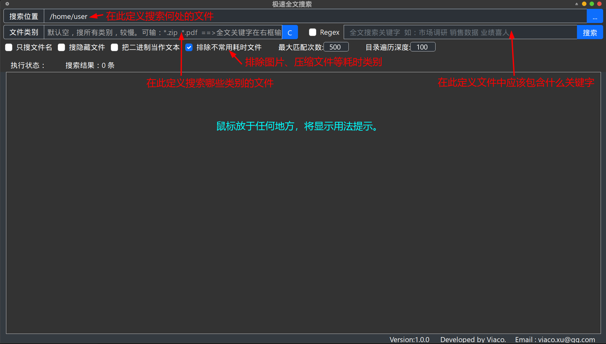

# 极速全文搜索

极速全文搜索是一个基于 Rust 语言开发的全文搜索工具，它可以快速、高效地搜索大量文本文件、压缩包、Word、PDF 文档等,甚至可以把任何文件作为文本文件进行搜索。并支持多种高级搜索功能，如正则表达式、多关键字搜索、按文件类型搜索等。还提供只搜索文件名功能。
## 界面简介

## 功能特点
- 无需索引：极速全文搜索无需建立索引，只需要扫描文件内容即可搜索。
- 高效：极速全文搜索使用 Rust 语言编写，采用**多线程并发处理**，搜索速度快、资源占用少。
- 全文搜索：支持全文搜索，即搜索整个文件内容，而不是仅仅搜索文件名。
- 多种搜索模式：支持普通搜索、多关键字并列搜索、正则表达式搜索、文件名搜索等。
- 按文件类型搜索：支持按文件类型搜索，如只搜索文本文件、只搜索代码文件、只搜索压缩包等。
- 自定义搜索目录：支持自定义搜索目录，可以指定要搜索的目录或文件。
- 结果展示：搜索结果展示在列表中，鼠标悬停将显示文件的命中前后文，点击文件名可以打开文件，点击前方目录图标可进入所在目录。文件名前方显示关键字**命中次数。点击标题头可排序**。

## 使用说明

### 安装

#### 下载安装包

下载对应平台的安装包，解压后运行安装程序即可。

编译完成后，在 `target/release` 目录下可以找到可执行文件 `rga`。

### 使用

#### 打开程序

双击运行 `rga` 程序，或者在命令行中输入 `rga` 打开程序。

#### 开始搜索

在搜索框中输入搜索词，然后按下回车或点击搜索按钮，即可开始搜索。

#### 高级搜索

在搜索框中输入 `:` 后面的搜索模式，即可打开高级搜索模式。

#### 自定义搜索目录

在搜索框中输入 `:` 后面的目录路径，即可打开自定义搜索目录模式。

#### 结果展示

搜索结果展示在列表中，可以方便地查看搜索结果。

#### 高级设置

点击菜单栏中的设置按钮，打开高级设置面板。

## 开发者

- 项目主页：
- 作者：Viaco
- 邮箱：viaco.xu@qq.com
- 微信：viacoxu